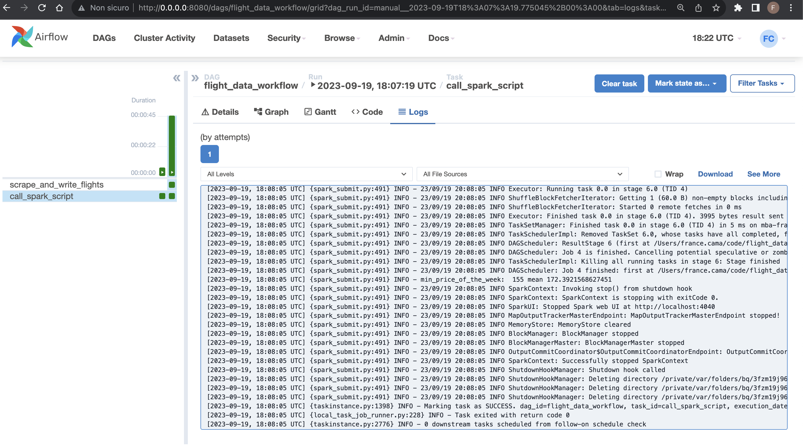
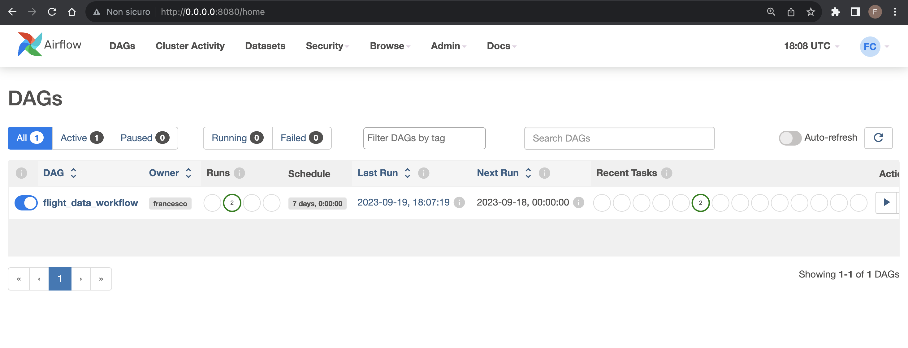

# Flight-Data

Flight data are scraped using Selenium and multiprocessing. Data
are stored in a PostgreSQL database and then processed using PySpark. 
At this stage the minimum ticket price for the period considered is returned, together with the average price for that route.
Additionally, an Apache Airflow workflow is implemented to
efficiently orchestrate the entire process on a weekly basis, ensuring up‑to‑date data and automation.

Data scraping using Selenium:

Data processing output using PySpark:

Data orchestration using Apache Airflow:

